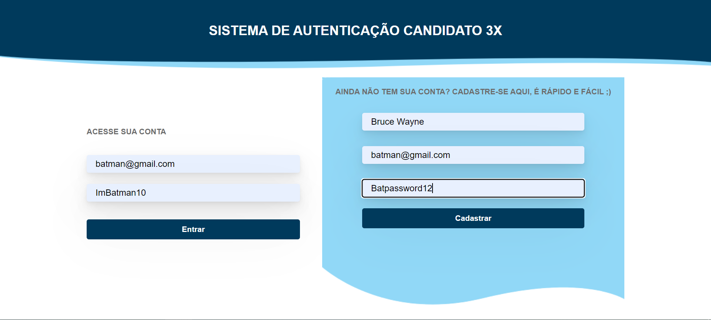
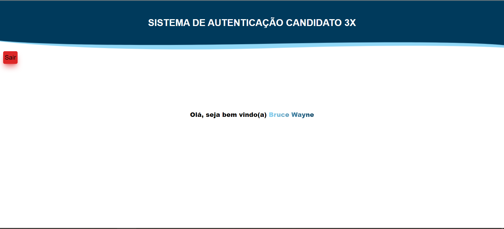
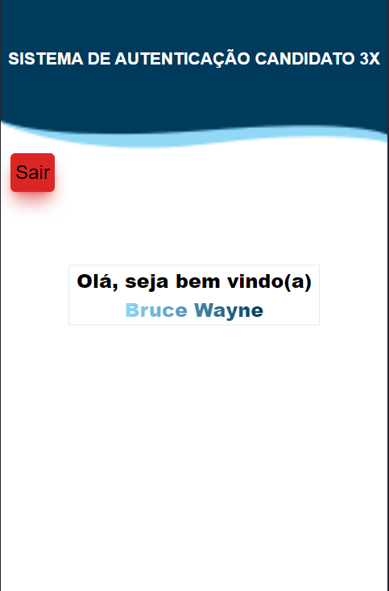
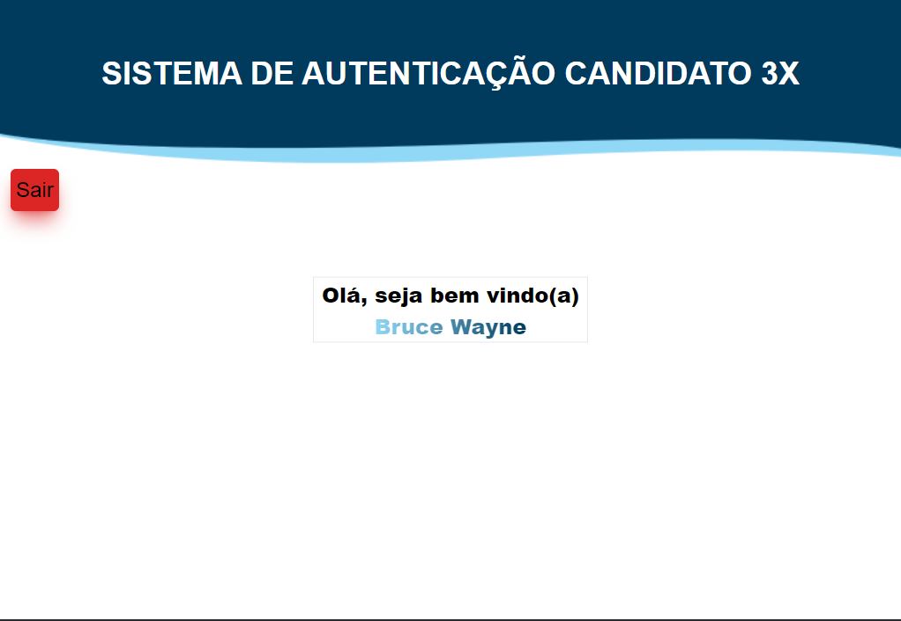

# 3XSolutions

## Table of contents

- [Overview](#overview)
  - [The challenge](#the-challenge)
  - [Screenshot](#screenshot)
  - [Solution link](#Solution-link)
- [My process](#my-process)
  - [Built with](#built-with)
  - [What I learned](#what-i-learned)
- [Author](#author)

## Overview

### The objectives

- Develop a system / page in web format where the user must authenticate himself, through an e-mail / password, previously registered, where in case of success, the system should display a page with the words "Welcome #UserName!".

- The layout will have to adapt to each screen size.

- Create, on the same authentication screen, a registration option, where the user, if not registered in the system, can effect his registration using: Username, E-mail and the desired Password. The password must contain at least one capital letter and one number. It should not be allowed to create two users with the same e-mails

### Solution video

[Click here to go to the video](https://youtu.be/AVvdtZQ4-Bo)

### Screenshot

Desktop    

Mobile Portrait  

Mobile Landscape  

## My process

### Built with

- ReactJS
- Fragment
- Tailwindcss
- NodeJS
- Npm
- Formik 
- Yup 
- Axios
- Cors
- Express
- MySQL
- Nodemon
- React-Router-Dom
- Js-Cookie

### What I learned

I learned to use formik and yup to make form and its validations with the help of Regex. Make front-to-back connections using Axios. Use Fragment to be able to store more than one component, use ReactJS Routes and how to use cookies to allow the user to access a page if their registration has been done correctly and how handle errors.

## Author

- Name - Christian
- Instagram - [@apredizti](https://www.instagram.com/apredizti/)
- Linkedin - [@Christian Silva]( https://www.linkedin.com/in/christian-silva-83172621a)
- GitHub - [@Christian Silva](https://github.com/Christian-M-Silva)